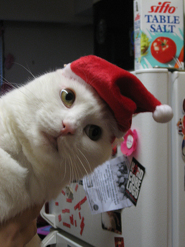

# Cat Randomizer App

  

😻Cute Cat Wearing Clothes😻

The Cat Randomizer application is a project that aims to display some information about cats using the REST API from [TheCatAPI](https://thecatapi.com/). This application allows users to get pictures and information about cats with one click.

## Feature

- Displays random pictures of cute cats.
- Displays information about cats, such as name, breed and description based on the breed selected.
- There is a button to obtain complete cat data.
- There is a button to download cat pictures.

## Installation

1. Make sure you have a code editor such as [Visual Studio Code](https://code.visualstudio.com/) installed on your computer.
2. You can use `XAMPP` to run the project. But I suggest you to use `Live Server` extension in Visual Studio Code.
3. Clone this repository or download the ZIP archive.
4. Open Visual Studio Code and navigate to the directory you downloaded.

## Use

1. After the installation is complete, start the Live Server by typing `Go Live` in the status bar or right-clicking on the HTML File `index.html` and typing `Open with Live Server` in the Explorer Window.
2. Open a browser and access `http://127.0.0.1:5500` to view the application.

## Project Results

---

Made with ❤️ by (https://github.com/AlifMP).
